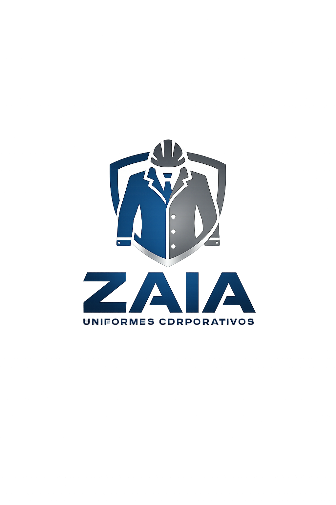

# Guia de Integração - CMS ZAIA para Landing Page

## 📋 Visão Geral

Este documento explica como integrar o sistema CMS (Mini Sistema de Administração) com sua landing page existente.

---

## 🚀 Estrutura de Arquivos

```
zaiaUniformes/
├── index.html                 (Landing page)
├── admin/
│   ├── login.html            (Página de login)
│   ├── dashboard.html        (Painel admin)
│   ├── api.js                (Funções de API)
│   ├── auth.js               (Gerenciamento de autenticação)
│   └── admin.js              (Lógica do painel)
├── js/
│   ├── script.js             (Scripts existentes)
│   └── dynamic-content-loader.js  (Carrega conteúdo dinâmico)
└── css/
    └── style.css             (Estilos)
```

---

## 🔑 Acessar o Painel Admin

1. **URL de Login:** `http://seu-dominio/admin/login.html`
2. **URL do Dashboard:** `http://seu-dominio/admin/dashboard.html`

Use suas credenciais de administrador para acessar.

---

## 📝 Como Usar Conteúdo Dinâmico na Landing Page

### 1️⃣ Opção 1: Conteúdo de Texto

No seu `index.html`, adicione o atributo `data-content="chave"`:

```html
<!-- Hero Section -->
<section class="hero">
    <h1 data-content="hero_title">ZAIA - Elite em Uniformes</h1>
    <p data-content="hero_subtitle">Qualidade e profissionalismo em cada detalhe</p>
</section>

<!-- About Section -->
<section class="about">
    <h2 data-content="about_title">Sobre Nós</h2>
    <p data-content="about_text">Lorem ipsum dolor sit amet...</p>
</section>

<!-- Serviços -->
<section class="services">
    <h2 data-content="services_title">Nossos Serviços</h2>
    <p data-content="services_description">Descubra o que oferecemos...</p>
</section>
```

### 2️⃣ Opção 2: Conteúdo em HTML

Se o conteúdo contém HTML (tags, formatação), use `data-html="true"`:

```html
<div data-content="footer_content" data-html="true">
    <!-- O HTML será inserido aqui -->
</div>
```

### 3️⃣ Opção 3: Imagens Dinâmicas

Para imagens gerenciadas pelo CMS:

```html
<!-- Hero image -->


<!-- Logo dinâmica -->

```

### 4️⃣ Opção 4: Parceiros Dinâmicos

Para carregar parceiros da API:

```html
<!-- Grid de Parceiros -->
<div class="partners-section">
    <h2>Nossos Parceiros</h2>
    <div data-partners="list" data-template="grid" class="partners-grid">
        <!-- Preenchido dinamicamente -->
    </div>
</div>

<!-- Ou com Swiper (slider) -->
<div class="swiper partners-swiper">
    <div class="swiper-wrapper" data-partners="list" data-template="slider">
        <!-- Parceiros como slides -->
    </div>
</div>
```

CSS para partners (exemplo):

```css
.partners-grid {
    display: grid;
    grid-template-columns: repeat(auto-fit, minmax(200px, 1fr));
    gap: 30px;
    margin-top: 40px;
}

.partner-item {
    text-align: center;
}

.partner-logo {
    width: 120px;
    height: 80px;
    object-fit: contain;
}

.partner-name {
    margin-top: 10px;
    font-weight: 500;
}
```

---

## ⚙️ Instalação no index.html

Adicione estes scripts **no final do seu `index.html`**, antes de fechar a tag `</body>`:

```html
<!-- API Module -->
<script src="/admin/api.js"></script>

<!-- Dynamic Content Loader -->
<script src="/js/dynamic-content-loader.js"></script>
```

**Ordem importante:**
1. `api.js` (deve vir primeiro!)
2. `dynamic-content-loader.js`

---

## 📊 Exemplos de Chaves de Conteúdo

Você pode criar qualquer chave. Aqui estão algumas sugestões:

```
# Hero
hero_title
hero_subtitle
hero_image

# Sobre
about_title
about_text

# Serviços
services_title
services_description
services_item_1
services_item_2

# Contato
contact_email
contact_phone
contact_address

# Footer
footer_text
footer_copyright
```

---

## 🔐 Autenticação

### Token JWT no LocalStorage

Quando faz login no painel admin, um token JWT é armazenado em `localStorage` com a chave `authToken`.

Para acessar rotas protegidas da API, o token é enviado automaticamente no header:

```
Authorization: Bearer TOKEN_JWT
```

### Logout

Ao fazer logout no painel, o token é removido do localStorage.

---

## 🠔 Exemplo Completo de HTML com Conteúdo Dinâmico

```html
<!DOCTYPE html>
<html lang="pt-br">
<head>
    <meta charset="UTF-8">
    <meta name="viewport" content="width=device-width, initial-scale=1.0">
    <title>ZAIA - Uniformes</title>
    <link rel="stylesheet" href="css/style.css">
</head>
<body>
    <!-- Hero Section -->
    <section class="hero">
        <div class="hero-content">
            <h1 data-content="hero_title">Carregando...</h1>
            <p data-content="hero_subtitle">Carregando...</p>
            
        </div>
    </section>

    <!-- About Section -->
    <section class="about">
        <h2 data-content="about_title">Carregando...</h2>
        <p data-content="about_text">Carregando...</p>
    </section>

    <!-- Parceiros -->
    <section class="partners">
        <h2 data-content="partners_title">Nossos Parceiros</h2>
        <div data-partners="list" data-template="grid">
            <!-- Preenchido dinamicamente -->
        </div>
    </section>

    <!-- Footer -->
    <footer>
        <div data-content="footer_text" data-html="true"></div>
        <p data-content="footer_copyright"></p>
    </footer>

    <!-- Scripts -->
    <script src="admin/api.js"></script>
    <script src="js/dynamic-content-loader.js"></script>
    <script src="js/script.js"></script> <!-- Seus scripts -->
</body>
</html>
```

---

## 🔄 Como Atualizar Conteúdo

1. **Acesse o painel admin:** `http://seu-site/admin/login.html`
2. **Faça login** com suas credenciais
3. **Vá para a aba "Conteúdos"**
4. **Clique em "Novo Conteúdo"** ou **"Editar"** um existente
5. **Digite a chave** (ex: `hero_title`) e o **valor** (ex: `Bem-vindo à ZAIA`)
6. **Clique em "Salvar"**
7. **A landing page recarrega automaticamente** com o novo conteúdo

---

## 🖼️ Upload de Imagens

### Via Admin Dashboard

1. **Página de Conteúdo:**
   - Edite um conteúdo e cole uma URL de imagem
   - Ou use a função de upload (se seu backend suportar)

2. **Página de Parceiros:**
   - Clique em "Novo Parceiro"
   - Digite o nome
   - Faça upload da logo (PNG, JPG, etc)
   - Clique em "Criar"

---

## 🛡️ Segurança

### Variáveis de Ambiente (Recomendado)

Se você estiver em produção, guarde a URL da API em uma variável de ambiente:

```javascript
// Criar um arquivo config.js
const API_BASE_URL = process.env.API_URL || 'https://zaia-uniformes-backend.onrender.com';
```

### CORS (Cross-Origin)

Seu backend deve permitir requisições do seu domínio frontend:

```
Frontend: https://seu-site.com
Backend: https://zaia-uniformes-backend.onrender.com
```

Se tiver problemas de CORS, fale com seu desenvolvedor backend.

---

## 🐛 Troubleshooting

### "Conteúdo não está carregando"

1. **Verifique o console do navegador:** `F12 → Console`
2. **Verifique a URL da API:** Deve estar correta em `api.js`
3. **Verifique o atributo:** Deve ser `data-content="chave"` (não `data-content = "chave"`)
4. **Verifique a chave:** Ela deve existir no painel admin

### "Erro 401 - Não Autenticado"

Algumas rotas podem requerer autenticação:

```javascript
// Se precisar de conteúdo protegido, o usuário deve estar logado
// ou você pode criar conteúdo públicos sem autenticação
```

### "Imagens não carregam"

1. Verifique se a URL da imagem é válida
2. Verifique se o arquivo de imagem existe no servidor
3. Verifique a restrição de CORS

---

## 📞 Suporte

Se tiver dúvidas:

1. **Verifique este documento** novamente
2. **Consulte o código** em `admin/api.js` e `js/dynamic-content-loader.js`
3. **Entre em contato** com seu desenvolvedor

---

## ✅ Checklist Final

- [ ] Adicionou `admin/api.js` ao seu projeto
- [ ] Adicionou `admin/auth.js` ao seu projeto
- [ ] Adicionou `admin/admin.js` ao seu projeto
- [ ] Criou `admin/login.html`
- [ ] Criou `admin/dashboard.html`
- [ ] Adicionou `js/dynamic-content-loader.js` ao seu projeto
- [ ] Adicionou os scripts ao final do `index.html`
- [ ] Testou o login em `/admin/login.html`
- [ ] Criou alguns conteúdos no painel
- [ ] Atualizou elementos no `index.html` com `data-content`
- [ ] Testou se os conteúdos carregam dinamicamente

---

**Pronto! Seu CMS está integrado.** 🎉
